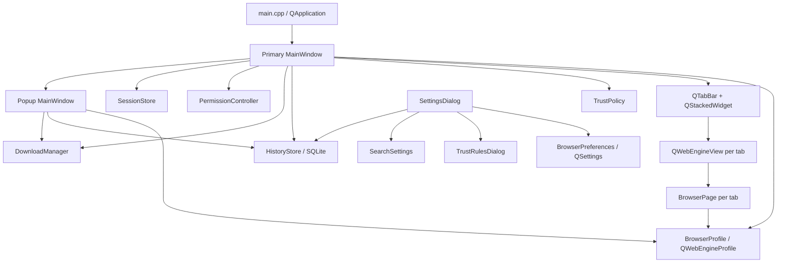
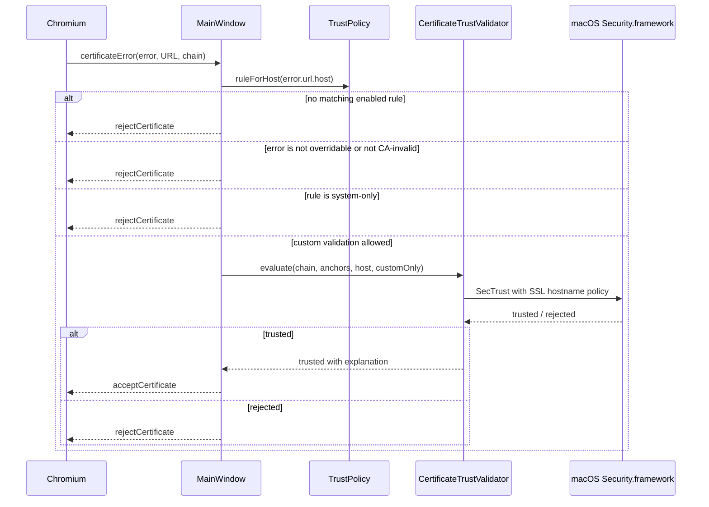

# PanBrowser technical architecture

This document explains how PanBrowser is put together, why the important
boundaries exist, and which invariants must survive future changes. It is aimed
at someone returning to the project after a long break.

For user-facing behavior and configuration examples, see
[README.md](../README.md). For planned work, see [ROADMAP.md](../ROADMAP.md).

## 1. Purpose and design constraints

PanBrowser is a small, deliberately limited Qt WebEngine browser for services
that may require CA certificates which should not be installed into the
operating-system trust store.

The main goals are:

- use Chromium's normal trust path for ordinary sites;
- allow additional CA certificates only for explicitly configured domains;
- fail closed when a rule, certificate, hostname, or navigation is invalid;
- keep the browser profile and all auxiliary data isolated from other browsers;
- expose enough browser functionality for daily use without becoming a full
  general-purpose browser;
- keep security-sensitive decisions visible in browser-owned UI.

Non-goals for the current implementation are browser extensions, account sync,
password management, exclusive certificate pinning for chains Chromium already
accepts, and silent handling of external applications or sensitive permissions.

Qt WebEngine was chosen because it provides a maintained Chromium embedding,
tabs, cookies, media support, downloads, and a cross-platform API while still
allowing PanBrowser to own the surrounding UI and certificate-error policy.

## 2. System overview



The primary `MainWindow` is the composition root. It creates and owns the
shared `BrowserProfile`, `DownloadManager`, and `HistoryStore`. Popup windows
reuse those objects and the current trust/search/preferences state; they do not
create independent browser profiles.

Each tab owns one `QWebEngineView` and one `BrowserPage`. `BrowserTabState` in
`MainWindow` contains UI state that Qt WebEngine does not provide as a single
unit: loading progress, pending restored URL, history transition, TLS status,
and the custom rule accepted for the top-level origin.

`MainWindow.cpp` is intentionally the orchestration layer. Parsing, policy,
storage, and geometry calculations live in smaller classes so they can be unit
tested without starting Chromium.

## 3. Ownership and lifetime

The primary window owns browser-wide resources:

- `BrowserProfile` owns Chromium cookies, site storage, cache configuration,
  permissions policy, and download signals.
- `DownloadManager` listens to the shared profile and outlives every tab.
- `HistoryStore` owns one named Qt SQL connection on the GUI thread.
- popup windows are children of the primary window and use
  `Qt::WA_DeleteOnClose`.

Destruction order matters. Popup windows and tab widgets must disappear before
the shared profile is deleted because their pages refer to that profile.
`MainWindow::~MainWindow()` enforces this ordering explicitly.

Background tabs restored from a previous session are lazy. Their URL is held in
`BrowserTabState::pendingUrl` and loaded only when the tab becomes active. This
reduces startup traffic and avoids immediately creating many authenticated
sessions.

Popup tabs are not included in session restoration. Closing the last primary
tab marks the session as intentionally discarded, clears `session.json`, and
closes the primary window.

## 4. TLS trust model

### 4.1 Normal path

Chromium evaluates every TLS connection normally. If it accepts a connection,
PanBrowser does not replace that decision. A successful top-level HTTPS load is
shown as `Secure · Chromium system trust` unless the top-level origin was
recovered through a configured custom rule.

HTTP loads are explicitly shown as `Not secure · HTTP connection`. Accepting a
custom certificate for an HTTPS subresource must never turn an HTTP top-level
page, or a different HTTPS origin, into a green secure state.

### 4.2 Custom-CA recovery path



The recovery path has several mandatory checks:

1. A currently loaded, enabled rule must match the certificate-error hostname.
2. The Chromium error must be overridable.
3. The only accepted error type is `CertificateAuthorityInvalid`.
4. `system-only` rules never override a Chromium rejection.
5. Security.framework reevaluates the complete server chain using an SSL policy
   bound to the requested hostname.
6. `custom-only` passes only configured anchors to `SecTrust` for this recovery
   evaluation; `system-plus-custom` also permits system anchors.

All other certificate failures remain rejected, including hostname mismatch,
expiration, revocation, certificate transparency, and pinning failures.

### 4.3 Important limitation

Qt exposes a callback for certificate *errors*, not every successful TLS
authentication. Therefore `custom-only` cannot reject a chain Chromium already
accepted through a system root. It is exclusive only inside the custom recovery
path. True exclusive pinning requires a lower-level network hook or a different
engine integration.

### 4.4 Rule invariants

`TrustSettings` is the editable representation used by the GUI;
`TrustPolicy` is the runtime representation containing parsed domain patterns
and decoded certificates. Both validation paths must enforce the same domain
rules.

- Exact domains match only themselves.
- `*.example.com` matches subdomains but not `example.com`.
- Wildcards directly below a public-looking top-level suffix, such as `*.com`,
  are rejected.
- Enabled rules may not overlap. Runtime loading repeats this check so a
  hand-edited file cannot make rule ordering weaken the intended policy.
- Rule names are unique and non-empty.
- Non-system modes require at least one readable certificate.
- The first-match implementation is not a priority system; overlap is an error.

If runtime loading fails, `TrustPolicy::load()` clears its rules before
returning. The browser therefore fails closed with no custom anchors.

## 5. Navigation security boundary

`BrowserPage::acceptNavigationRequest()` delegates scheme classification to
`ExternalNavigationPolicy`.

- `http`, `https`, `about`, `blob`, and `data` remain inside WebEngine.
- `file`, `javascript`, `vbscript`, `qrc`, Chromium internal schemes, and
  extension/devtools schemes are blocked.
- Other top-level schemes may produce a browser-owned confirmation only for a
  direct link click, typed navigation, or form submission.
- Subframe and scripted external navigation is rejected.
- The confirmation shows the source origin and destination as plain text, has
  Cancel as the default, and passes an accepted URL directly to
  `QDesktopServices` without a shell.
- Switching tabs or starting another navigation cancels an outstanding prompt.

`newWindowRequested` is accepted only when Qt marks it user initiated.
Background-tab requests become tabs; explicit window/dialog destinations become
full PanBrowser windows with an address bar and TLS status. Automatic popups are
discarded.

## 6. Permission model

`PermissionPolicy` is the pure decision layer and `PermissionController` owns
the prompt queue.

- Camera, microphone, combined media capture, and location may be prompted only
  for a valid HTTPS origin in the active tab.
- HTTP origins, background tabs, notifications, screen capture, clipboard,
  mouse lock, local fonts, and unknown permission types are denied.
- The WebEngine profile uses `AskEveryTime`; PanBrowser does not persist grants.
- Changing tabs, closing a tab, or starting navigation denies outstanding
  requests associated with the previous page.
- macOS may display a second operating-system prompt after PanBrowser's
  `Allow once` action. Usage descriptions live in `Info.plist.in`.

When adding a WebEngine capability, decide explicitly whether it belongs in
`PermissionPolicy`; never rely only on Chromium's default prompt behavior.

## 7. Persistent data and privacy boundaries

On macOS, application data is rooted at
`~/Library/Application Support/PanBrowser`; cache data is rooted at
`~/Library/Caches/PanBrowser`. Exact paths are obtained through
`QStandardPaths`, not hard-coded in implementation code.

| Data | Owner | Format and behavior |
| --- | --- | --- |
| `WebEngine/Profile/` | `BrowserProfile` | Cookies, local storage, IndexedDB, service workers, and other Chromium profile data. |
| cache `WebEngine/` | `BrowserProfile` | Disk HTTP cache, isolated from other browsers. |
| `rules.json` | `TrustSettings` / `TrustPolicy` | Versioned trust configuration; atomic write with `.backup`. |
| `Certificates/` | `TrustRulesDialog` | Imported CA files referenced by paths relative to `rules.json`. |
| `search-engines.json` | `SearchSettings` | Versioned engines and default selection; atomic write with `.backup`. |
| `history.sqlite` | `HistoryStore` | WAL-mode SQLite browsing history, limited to 50,000 visits. |
| `session.json` | `SessionStore` | Up to 30 restorable HTTP(S) tabs, atomically written. |
| `downloads.json` | `DownloadHistoryStore` | Up to 200 download records; paths and source host, not complete source URLs. |
| native `QSettings` | `BrowserPreferences`, window/download UI | Start page, startup/cookie/history choices, window geometry, last download directory, and pending data-reset marker. |

Session cookies are discarded by default. Enabling “keep sign-ins” changes the
profile to `ForcePersistentCookies`; otherwise only cookies explicitly marked
persistent by sites survive.

Full site-data deletion is scheduled for the next launch. Chromium profile
directories are removed before `BrowserProfile` is constructed because deleting
an open WebEngine profile is unsafe. `BrowserDataCleanup` verifies that every
recursive deletion target is a strict child of the expected managed root.

### 7.1 Settings save transaction

The unified Settings dialog spans native `QSettings` and two JSON files, so a
single filesystem transaction is unavailable. Its save order and rollback are
therefore deliberate:

1. validate every page without changing persistent state;
2. snapshot both JSON files and their backups;
3. save general preferences;
4. save search settings;
5. save trust rules last;
6. finalize imported certificate files only after every save succeeds.

If a later step fails, earlier preferences and files are restored from their
snapshots. If rollback itself is incomplete, the error dialog says so rather
than claiming that nothing changed. Do not reorder these operations casually:
trust expansion is the most security-sensitive mutation and must remain last.

## 8. History and address-bar completion

Only successful top-level HTTP(S) loads are recorded. Failed loads, external
schemes, and lazy tabs loaded solely because of session restoration are skipped.
Credentials and fragments are removed; query parameters are retained so an
entry can reopen the same page. This means query strings containing sensitive
application state are also retained until the user removes history.

The SQLite schema separates `pages` from individual `visits`:

- `pages` holds the sanitized URL, latest title, visit count, typed count, and
  last visit time;
- `visits` holds each timestamp and transition type with a foreign key to its
  page;
- deleting visits rebuilds aggregates only for affected page IDs and removes a
  page row when it has no visits left.

Pruning starts after 50,100 visits and returns the database to 50,000. It first
collects the page IDs referenced by the oldest visits, deletes those visits, and
rebuilds only those pages. Rebuilding every page here would perform tens of
thousands of SQL statements on the GUI thread.

Completion searches URL and title locally, calculates each match class once,
and then orders candidates by:

1. exact hostname;
2. hostname prefix;
3. address prefix;
4. title word prefix;
5. hostname substring;
6. URL substring;
7. title substring;
8. most recent visit, then typed count, then total visit count.

All matching page rows participate before the final eight results are selected.
Do not add a recency-only SQL limit before relevance sorting; doing so causes an
old exact address to disappear behind newer weak matches.

`HistoryCompletionPopup` is a non-activating tool window. Its application event
filter handles Up/Down, Enter, Escape, Tab/Right for ghost completion, clicks,
focus changes, and application deactivation while leaving text focus in
`AddressLineEdit`.

## 9. Search input resolution

`resolveAddressInput()` is the only place that decides whether address-bar text
is navigation or search input.

- explicit HTTP(S), domains, IP addresses, `localhost`, and host-like strings
  navigate directly;
- `?query` forces the default search engine;
- `@keyword query` selects one enabled engine for that request;
- other text uses the configured default engine;
- explicit non-web schemes are rejected when typed in the address bar.

Search templates contain `{searchTerms}` exactly once. Terms are percent-encoded
once at substitution time. HTTP templates are permitted for user-controlled
intranet cases but the UI and README must continue to explain that queries are
visible in transit.

## 10. Downloads

`DownloadManager` listens once to the shared profile. Every request opens a
system destination picker, sanitizes the suggested filename, sets the chosen
directory and filename on Qt's request, then calls `accept()`.

Files never open automatically. Pause, resume, cancel, open, and reveal are
explicit user actions. Active records are saved on a short timer; terminal
states are saved immediately. Records left active when PanBrowser shuts down or
starts again are marked interrupted. Clearing download history does not delete
files.

## 11. Startup and shutdown sequence

Primary-window startup is ordered as follows:

1. ensure `rules.json` and `Certificates/` exist;
2. load trust rules and preferences;
3. load or create search settings;
4. apply a pending profile reset before Chromium opens the profile;
5. create the shared browser profile, download manager, and history store;
6. create the UI and permission controller;
7. restore safe window geometry;
8. reload runtime trust rules;
9. restore command-line, start-page, or lazy session tabs.

On close, the primary window saves or clears the tab session according to the
startup preference, persists geometry, closes popups, destroys tab pages, and
only then destroys shared browser resources.

## 12. Build, packaging, and diagnostics

The project requires CMake, Ninja, Qt 6.11 or newer, and C++20. macOS adds the
Objective-C++ validator and links Security.framework; other platforms compile a
fail-closed validator stub until their native validators are implemented.

Development verification:

```sh
cmake -S . -B build -G Ninja -DCMAKE_BUILD_TYPE=Debug
cmake --build build --parallel
ctest --test-dir build --output-on-failure
```

`scripts/build-app.sh` performs a release build, runs tests, executes
`macdeployqt` twice so the nested `QtWebEngineProcess` helper is fixed up,
copies the result to `dist/PanBrowser.app`, ad-hoc signs the complete bundle, and
verifies the signature. The output is suitable for local testing, not public
distribution; Developer ID signing and notarization remain separate roadmap
items.

The Diagnostics settings page reports application, Qt WebEngine, Chromium,
security-patch, graphics, sandbox, runtime-flag, and profile-path information.
It infers forced overrides from arguments and environment variables; “Automatic”
GPU status is not proof of the exact backend selected by Chromium.

## 13. Tests and change discipline

`tests/TrustConfigurationTests.cpp` is a Qt Test executable covering the pure
policy and persistence layers: domains and rule validation, settings backups,
window placement, sessions, cleanup boundaries, downloads, permissions,
external navigation, popup geometry, search parsing, history ranking/deletion,
corrupt-database behavior, and ghost completion.

The test target deliberately excludes `MainWindow` and a live WebEngine process,
so signal wiring and visual state still need a short manual smoke test after
security- or lifecycle-sensitive changes.

Recommended pre-commit checks:

```sh
cmake --build build --parallel
ctest --test-dir build --output-on-failure
git diff --check
```

For a stricter compiler pass:

```sh
cmake -S . -B build-strict -G Ninja \
  -DCMAKE_BUILD_TYPE=Debug \
  -DCMAKE_CXX_FLAGS='-Wall -Wextra -Wpedantic -Wconversion -Wshadow'
cmake --build build-strict --parallel
ctest --test-dir build-strict --output-on-failure
```

## 14. Invariants checklist

Before merging a change, verify the relevant invariants:

- no HTTP page can display a secure TLS indicator;
- a subresource certificate decision cannot describe a different top-level
  origin as custom-validated;
- custom CA acceptance remains limited to overridable unknown-CA errors and is
  followed by native chain and hostname validation;
- invalid or ambiguous trust configuration fails closed;
- external applications and sensitive permissions require browser-owned,
  active-tab user interaction;
- popup windows retain visible browser chrome and share the isolated profile;
- tab views die before their shared profile;
- full profile deletion happens only before profile construction and only below
  managed roots;
- Settings failure cannot silently leave a newly expanded trust policy behind;
- history relevance is evaluated before the result limit;
- pruning and individual deletion rebuild only affected history pages;
- persistent file formats remain versioned and writes remain atomic;
- new persistent data is documented in both this file and the README data tree.

## 15. Known extension points

### Adding a platform certificate validator

Implement the `CertificateTrustValidator::evaluate()` contract using the
platform trust API, keep hostname verification inside that evaluation, wire the
source in CMake, and add platform tests. The fallback must continue to reject,
never accept by assumption.

### Adding a preference

Add it to `BrowserPreferences`, validate before save, expose it in
`SettingsDialog`, decide whether popup windows need a live copy, and include it
in rollback behavior if saving it can precede another settings mutation.

### Adding a WebEngine signal or capability

Connect it for every page inside `MainWindow::connectBrowserSignals()`, decide
how tab switching and navigation cancel its state, and check whether popup
windows should share or isolate the associated controller.

### Changing a persistent format

Increment the format or schema version, implement an explicit migration or fail
closed while preserving the old file, retain atomic writes, and add a round-trip
plus corrupt-input test. Never silently reinterpret security configuration from
an unknown version.

