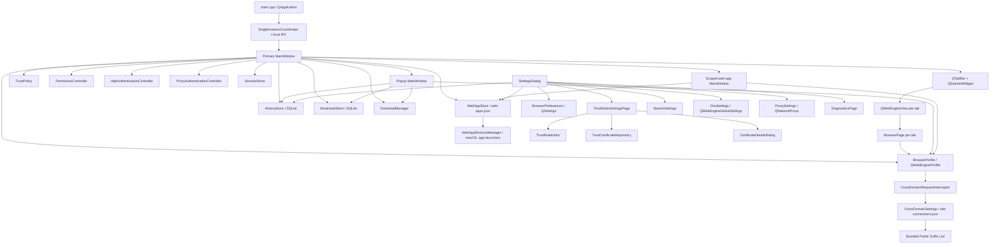
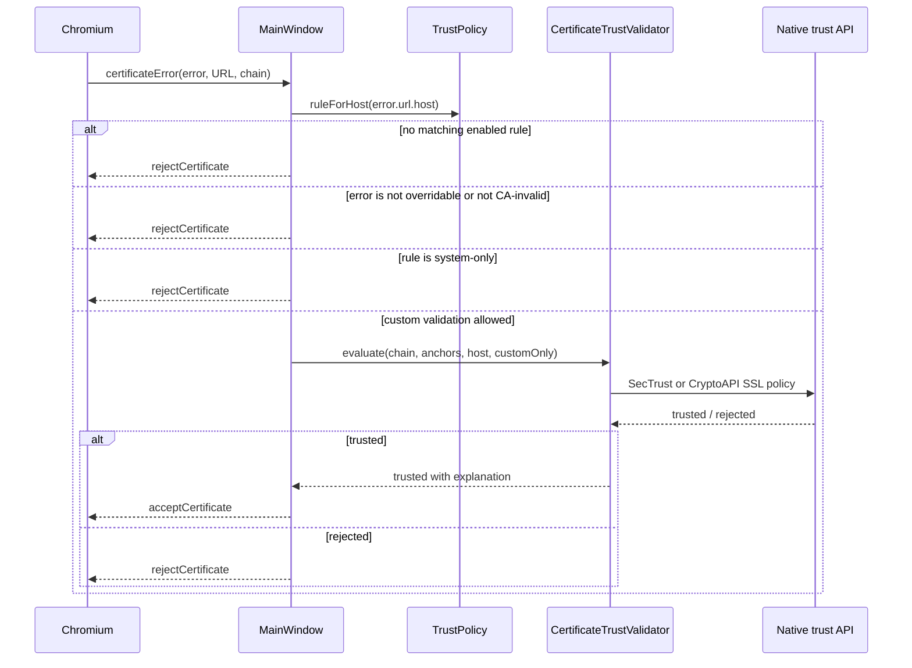

# PanBrowser technical architecture

This document explains how PanBrowser is put together, why the important
boundaries exist, and which invariants must survive future changes. It is aimed
at someone returning to the project after a long break.

This document describes the **0.1.0** source milestone baseline. PanBrowser does
not yet claim the compatibility or maintenance guarantees of a stable
general-purpose browser. Update this document together with any change to
component ownership, startup order, persistence, or a security boundary.

For user-facing behavior and configuration examples, see
[README.md](../README.md). For planned work, see [ROADMAP.md](../ROADMAP.md).

## 1. Purpose and design constraints

PanBrowser is a small, deliberately limited Qt WebEngine browser for services
that may require CA certificates which should not be installed into the
operating-system trust store.

The main goals are:

- use Chromium's normal trust path for ordinary sites;
- allow additional CA certificates only for explicitly configured domains;
- fail closed when a rule, certificate, hostname, or navigation is invalid;
- keep the browser profile and all auxiliary data isolated from other browsers;
- expose enough browser functionality for daily use without becoming a full
  general-purpose browser;
- keep security-sensitive decisions visible in browser-owned UI.

Non-goals for the current implementation are browser extensions, account sync,
password management, exclusive certificate pinning for chains Chromium already
accepts, and silent handling of external applications or sensitive permissions.

Qt WebEngine was chosen because it provides a maintained Chromium embedding,
tabs, cookies, media support, downloads, and a cross-platform API while still
allowing PanBrowser to own the surrounding UI and certificate-error policy.

## 2. System overview



The primary `MainWindow` is the composition root. It creates and owns the
shared `BrowserProfile`, `DownloadManager`, `HistoryStore`, `BookmarkStore`,
and `WebAppStore`. Popup and installed web-app windows reuse those objects and
the current trust, search, DNS, proxy, and preference state; they do not create
independent browser profiles.

Each tab owns one `QWebEngineView` and one `BrowserPage`. `BrowserTabState` in
`MainWindow` contains UI state that Qt WebEngine does not provide as a single
unit: loading progress, pending restored URL, history transition, TLS status,
the custom rule accepted for the top-level origin, the persisted title and pin
state, and an optional developer tools window. `BrowserTabBar` owns the visual
pin marker, compact size, hidden close button, and pinned-group movement
boundary; `MainWindow` mirrors every accepted tab move in the page stack.

Normal Fullscreen API requests and video pop-out are deliberately separate.
`BrowserFullScreenController` keeps the page in its original view, hides only
the browser chrome, and restores the previous visibility and window state on
exit. `VideoElementBridge` injects an isolated, browser-provided button over a
video while the pointer is on it. A trusted click carries a per-page random
capability through `BrowserPage` and issues a short-lived, tab-bound fullscreen
request for that video. Only this marked request is routed through the existing
`DetachedVideoSession` and `DetachedVideoWindow` page-transfer path. Navigation,
tab closure, expiry, or a mismatched request clears the capability, so page
scripts and ordinary site fullscreen requests cannot be mistaken for a pop-out
request. The detached window is created with `Qt::WindowStaysOnTopHint`, making
video pop-out an always-on-top surface by default on every supported platform.
It is frameless and contains only the WebEngine view plus a native close button
shown while the pointer is inside the window. Dragging beyond the platform drag
threshold moves the window from any content point, while a short click remains
available to the video's own controls. The bridge reports intrinsic video
dimensions with the trusted request, falling back to the rendered element size
and then 16:9. `DetachedVideoWindow` uses that ratio for its initial geometry
and its Qt-controlled edge or corner resize path. On macOS the platform layer
also applies `NSWindow.contentAspectRatio`, because AppKit can intercept a live
window-edge resize before Qt receives content mouse events.

`MainWindow.cpp` is intentionally the orchestration layer. Parsing, policy,
storage, and geometry calculations live in smaller classes so they can be unit
tested without starting Chromium.

Trust-rule settings follow the same boundary. `TrustRulesSettingsPage` owns the
rule collection and coordinates Settings save/rollback. `TrustRuleEditor` owns
the controls for one selected rule, while `CertificateDetailsDialog` is a
read-only certificate view. `TrustCertificateRepository` is the only component
that copies imported CA files: it keeps new files pending until the complete
Settings transaction succeeds, removes unreferenced imports on commit, and
rolls all pending files back when Settings is cancelled. Failed deletions are
reported to the user and remain pending for a retry during final destruction.

## 3. Ownership and lifetime

The primary window owns browser-wide resources:

- `BrowserProfile` owns Chromium cookies, site storage, cache configuration,
  permissions policy, and download signals.
- `DownloadManager` listens to the shared profile and outlives every tab.
- `HistoryStore` owns one named Qt SQL connection on the GUI thread.
- `BookmarkStore` owns a separate named Qt SQL connection on the GUI thread.
- `WebAppStore` owns the versioned, atomically written installed-app registry.
- `PermissionController` serializes active-tab permission prompts.
- `HttpAuthenticationController` serializes server credential prompts and
  never persists passwords.
- `ProxyAuthenticationController` serializes HTTP-proxy credential prompts and
  never persists passwords.
- popup windows are children of the primary window and use
  `Qt::WA_DeleteOnClose`.

Destruction order matters. Popup windows and tab widgets must disappear before
the shared profile is deleted because their pages refer to that profile.
`MainWindow::~MainWindow()` enforces this ordering explicitly.

Background tabs restored from a previous session are lazy. Their URL is held in
`BrowserTabState::pendingUrl` and loaded only when the tab becomes active. This
reduces startup traffic and avoids immediately creating many authenticated
sessions.

Pinned tabs form one stable group at the left of the primary tab bar. Pinning
or unpinning moves a tab to its corresponding boundary, and drag reordering is
limited to the tab's current group. Pinning does not prevent an explicit close.
Pinned tabs are saved and restored regardless of the startup preference; when
the start-page mode is selected, only pinned tabs are restored from the session
and the configured start page remains active. Popup and web-app windows do not
expose pin controls.

Popup tabs are not included in session restoration. Closing the last primary
tab marks the session as intentionally discarded, clears `session.json`, and
closes the primary window.

### 3.1 Installed web apps

Qt WebEngine exposes Chromium rendering and persistent-profile primitives but
does not expose Chromium's PWA installation UI. PanBrowser therefore owns a
small manifest-based installation layer:

1. after a successful HTTPS load, `MainWindow` looks for a manifest link in an
   isolated JavaScript world;
2. only same-origin HTTPS manifest URLs are offered for installation;
3. `BrowserPage` fetches the manifest in the existing page context so the
   request uses the same WebEngine profile, cookies, and certificate handling;
4. `WebAppStore::parseManifest()` validates size, JSON, origin, start URL,
   scope, display mode, text lengths, and derives a stable SHA-256 app ID;
5. the user sees the resolved start URL and scope before an atomic write to
   `web-apps.json`;
6. the app opens in a `MainWindow` with one scope-restricted `BrowserPage`, no
   tab strip or address field, compact navigation controls, and the standard
   PanBrowser TLS and permission UI.

`BrowserPage::acceptNavigationRequest()` rejects top-level HTTP/HTTPS
navigation outside an installed app's origin and scope. User-clicked links are
opened by the primary window in a normal tab; automatic navigation is blocked,
and form submissions are not converted into lossy URL-only GET requests.
External schemes still pass through the ordinary confirmation policy.
New-window requests from app windows are adopted by a normal browser page via
`QWebEngineNewWindowRequest::openIn()`, preserving opener and request state.
App windows share the main profile deliberately so an installed banking or
communications app retains the same sign-in and domain-scoped custom-CA
behavior as a normal tab. They are independent top-level windows rather than
transient children: closing the browser window closes ordinary popup windows
but leaves installed apps running. On macOS, a small delegate proxy forwards
Qt's existing application-delegate behavior and handles the native reopen
AppleEvent by restoring and activating the primary browser window.

`ApplicationLaunchRequest` is the platform-neutral startup contract. A request
activates the browser, opens a validated HTTP(S) URL, or opens an installed app
by its validated SHA-256 ID. `SingleInstanceCoordinator` exposes that contract
over a bounded, user-only `QLocalServer`; a second process forwards its request
and exits before opening the persistent WebEngine profile. Shortcut and URL
launches can therefore reuse an already-running browser safely. Command-line
options are parsed before this contract is created and are never interpreted as
restorable tab URLs.

On macOS, `WebAppShortcutManager` creates signed launcher bundles below
`~/Applications/PanBrowser Apps`. Each bundle contains a small shared Mach-O
launcher, its resolved app ID and host executable path, and an `.icns` generated
from the stored page icon. The launcher has no Qt or WebEngine copy: it invokes
PanBrowser with `--app-id`, falling back to the main bundle identifier if the
recorded executable has moved. Bundle names and deletion targets are sanitized
and verified against the embedded app ID before any filesystem mutation.

The registry stores a bounded PNG copy of the page icon. Manifest contents and
site-controlled names never become executable paths or command lines. Removing
an installed app removes only its registry entry; clearing site data remains a
separate explicit privacy action.

### 3.2 Window chrome

Normal browser and popup windows use `WindowChromeController` only on macOS.
Before the native window is created it requests
`Qt::ExpandedClientAreaHint` and `Qt::NoTitleBarBackgroundHint`, allowing the
existing tab toolbar to occupy the native title-bar area without replacing the
system frame or window controls. `Qt::WA_LayoutOnEntireRect` is required as
well: without it, `QMainWindow` reserves the safe top margin and leaves the tab
toolbar in a second row even though the native title bar is transparent.

After the platform window exists, the controller observes
`QWindow::safeAreaMarginsChanged`. The macOS adapter also hides the native
window-title text, reinforces the full-size content-view style, and measures the
actual traffic-light button frames. Only the resulting left and right margins
are applied to the tab layout: those keep tabs clear of system controls, while
applying the top safe margin would move the strip back below the title bar. The
pure `integratedChromeContentMargins()` helper keeps platform geometry
independently testable.

Mouse presses reach the controller only when they land directly on the empty
tab-toolbar or tab-container background. It calls `QWindow::startSystemMove()`
there, preserving native movement behavior while leaving tab dragging and the
new-tab button untouched. A double click on the same empty area toggles the
maximized state. Surface-destruction events disconnect the native handle before
queued geometry updates can run, and guarded pointers protect layouts owned by
the toolbar during teardown. Installed web apps retain their compact native
title bar. Windows and Linux always retain ordinary system decorations: Windows
uses its native non-client frame, while Linux leaves decoration policy to the
active X11 or Wayland window manager.

The application menu follows the same platform split. On macOS, Qt exposes the
`PanBrowser` menu through the system menu bar. Windows and Linux do not create a
`QMenuBar`; the same actions are attached to the compact overflow button at the
right edge of the navigation toolbar, avoiding a second application-name row
below the native window title.

## 4. TLS trust model

### 4.1 Normal path

Chromium evaluates every TLS connection normally. If it accepts a connection,
PanBrowser does not replace that decision. A successful top-level HTTPS load is
shown as `Secure · Chromium system trust` unless the top-level origin was
recovered through a configured custom rule.

HTTP loads are explicitly shown as `Not secure · HTTP connection`. Accepting a
custom certificate for an HTTPS subresource must never turn an HTTP top-level
page, or a different HTTPS origin, into a green secure state.

### 4.2 Custom-CA recovery path



The recovery path has several mandatory checks:

1. A currently loaded, enabled rule must match the certificate-error hostname.
2. The Chromium error must be overridable.
3. The only accepted error type is `CertificateAuthorityInvalid`.
4. `system-only` rules never override a Chromium rejection.
5. The native backend reevaluates the complete server chain using an SSL policy
   bound to the requested hostname and Server Authentication usage.
6. `custom-only` permits only configured anchors for this recovery evaluation;
   `system-plus-custom` also permits native system anchors.

All other certificate error types reported by Chromium remain rejected,
including hostname mismatch, expiration, known revocation, certificate
transparency, and pinning failures.

On macOS, the backend uses `SecTrust` with explicit anchors. On Windows, it
converts the Qt DER chain into temporary `CERT_STORE_PROV_MEMORY` stores and
uses `CertGetCertificateChain` plus `CERT_CHAIN_POLICY_SSL`. Custom validation
runs in an application chain engine whose `hExclusiveRoot` contains only the
configured anchors; `CERT_CHAIN_EXCLUSIVE_ENABLE_CA_FLAG` also permits an
explicit non-self-signed CA to terminate the chain. `system-plus-custom` first
tries the default Windows engine, then the exclusive custom engine. Temporary
stores are destroyed after evaluation and are never persisted.

The Windows backend enables the OS strong-signature policy, which rejects weak
hash algorithms and undersized server keys. Chain building is cache-only: the
certificate-error callback never waits for AIA, CRL, OCSP, or root downloads.
A positive cached revoked result fails validation, while unavailable revocation
data remains unknown. Servers must therefore send required intermediates in the
TLS chain. Chromium still controls the original connection and PanBrowser only
enters this path for an overridable unknown-CA error.

On Linux, the backend uses OpenSSL `X509_STORE` and `X509_verify_cert` directly.
`custom-only` starts with an empty in-memory store; `system-plus-custom` first
loads OpenSSL's configured default CA file and hashed directory. Configured
anchors are then added in memory. `X509_V_FLAG_PARTIAL_CHAIN` permits an
explicit intermediate CA to terminate the chain, matching the other native
backends. Verification uses the SSL server purpose, authentication level 2,
strict X.509 processing, IDNA-aware DNS matching, and IP SAN matching. It does
not perform network AIA, CRL, or OCSP retrieval, so required intermediates must
be supplied by the server. Revocation is explicitly soft-fail for chains
accepted through this recovery path: a `CertificateRevoked` error already
reported by Chromium is never overridden, but PanBrowser cannot independently
establish the revocation status of a chain that Chromium could not build to a
trusted CA. Performing blocking network revocation requests inside the
certificate-error callback would stall the UI and introduce a second network
validation path; a future implementation should use a freshness-checked,
asynchronously maintained revocation cache instead.

### 4.3 Important limitation

Qt exposes a callback for certificate *errors*, not every successful TLS
authentication. Therefore `custom-only` cannot reject a chain Chromium already
accepted through a system root. It is exclusive only inside the custom recovery
path. True exclusive pinning requires a lower-level network hook or a different
engine integration.

### 4.4 Rule invariants

`TrustSettings` is the editable representation used by the GUI;
`TrustPolicy` is the runtime representation containing parsed domain patterns
and decoded certificates. Both validation paths must enforce the same domain
rules.

- Exact domains match only themselves.
- `*.example.com` matches subdomains but not `example.com`.
- Wildcards directly below a public-looking top-level suffix, such as `*.com`,
  are rejected.
- Enabled rules may not overlap. Runtime loading repeats this check so a
  hand-edited file cannot make rule ordering weaken the intended policy.
- Rule names are unique and non-empty.
- Non-system modes require at least one readable certificate.
- The first-match implementation is not a priority system; overlap is an error.

If runtime loading fails, `TrustPolicy::load()` clears its rules before
returning. The browser therefore fails closed with no custom anchors.

## 5. Navigation security boundary

`BrowserPage::acceptNavigationRequest()` delegates scheme classification to
`ExternalNavigationPolicy`.

- `http`, `https`, `about`, `blob`, and `data` remain inside WebEngine.
- `file`, `javascript`, `vbscript`, `qrc`, Chromium internal schemes, and
  extension/devtools schemes are blocked.
- Other top-level schemes may produce a browser-owned confirmation only for a
  direct link click, typed navigation, or form submission.
- Subframe and scripted external navigation is rejected.
- The confirmation shows the source origin and destination as plain text, has
  Cancel as the default, and passes an accepted URL directly to
  `QDesktopServices` without a shell.
- Switching tabs or starting another navigation cancels an outstanding prompt.

`newWindowRequested` is accepted only when Qt marks it user initiated.
Background-tab requests become tabs; explicit window/dialog destinations become
full PanBrowser windows with an address bar and TLS status. Automatic popups are
discarded.

## 6. Permission model

`PermissionPolicy` is the pure decision layer and `PermissionController` owns
the prompt queue.

- Camera, microphone, combined media capture, and location may be prompted only
  for a valid HTTPS origin in the active tab.
- HTTP origins, background tabs, notifications, screen capture, clipboard,
  mouse lock, local fonts, and unknown permission types are denied.
- The WebEngine profile uses `AskEveryTime`; PanBrowser does not persist grants.
- Changing tabs, closing a tab, or starting navigation denies outstanding
  requests associated with the previous page.
- macOS may display a second operating-system prompt after PanBrowser's
  `Allow once` action. Usage descriptions live in `Info.plist.in`.

When adding a WebEngine capability, decide explicitly whether it belongs in
`PermissionPolicy`; never rely only on Chromium's default prompt behavior.

### 6.1 Developer tools

Developer tools are an explicit profile preference and default to disabled.
`MainWindow` removes Qt's `InspectElement` action from every tab's standard
context menu, then adds a PanBrowser-owned replacement only while the
preference is enabled. The same preference controls the menu action and its
keyboard shortcuts. Qt's ordinary shortcut dispatch remains the primary path;
an application event filter handles the same registered key sequences when a
focused WebEngine surface consumes `ShortcutOverride`. The filter is limited
to the active PanBrowser window and enabled actions, and suppresses auto-repeat.

Opening the tools creates a separate `QWebEngineView` on the shared
`BrowserProfile` and binds it with `QWebEnginePage::setDevToolsPage()`. Each tab
may own at most one such window. Closing the tab, disabling the preference, or
destroying its browser window detaches and deletes the developer tools view
before the shared profile is destroyed. The Chromium credits view and other
service views never receive these actions.

### 6.2 Localization

English source strings are the fallback. `LocalizationManager` resolves the
saved `InterfaceLanguage` before `MainWindow` is constructed: an explicit
English or Russian choice wins, while `System` selects the first supported
entry from `QLocale::system().uiLanguages()` and otherwise falls back to
English. Unknown persisted values also fail safely to English.

`qt_add_translations` embeds `panbrowser_ru.qm` and the English plural-only
catalog under `:/i18n`. A small `QPlatformTheme` context in the application
catalog covers standard dialog buttons without requiring the separately
distributed Qt translation package. The first implementation applies language
changes after restart; rebuilding every manually constructed widget in live
WebEngine windows would add avoidable state and lifecycle risk.

### 6.3 Secure DNS

`DnsSettings` owns the versioned resolver configuration and validates both the
built-in and user-defined providers. The safe default is `System`: Chromium
uses the resolver configuration supplied by the operating system. The other
modes map directly to `QWebEngineGlobalSettings::DnsMode` and either fall back
to system DNS when DNS-over-HTTPS fails or require the selected secure provider.

DNS configuration is global to Qt WebEngine, not tied to an individual
`QWebEngineProfile`. The primary `MainWindow` therefore loads and applies it
before constructing `BrowserProfile`; tabs, popups, and installed web apps all
share the same effective resolver. A settings change is applied at runtime.
Invalid or unreadable startup configuration falls back to System without
overwriting the bad file.

Provider templates must be valid HTTPS URLs without credentials or fragments.
Only the optional `{?dns}` URI variable is accepted, at most once; omitting it
allows Chromium to use POST. Diagnostics expose the selected mode and provider
name but deliberately omit template URLs because custom endpoints may contain
account-specific identifiers. Serialized settings are capped at 256 KiB on
both read and write, so the editor cannot create a file that the next launch
would reject.

### 6.4 Proxy

`ProxySettings` owns a versioned browser-wide configuration with three modes:
operating-system proxy, no proxy, and one manual proxy. Manual configuration is
either HTTP (including HTTPS tunnelling through CONNECT) or SOCKS5 and contains
only a validated host, port, and optional HTTP username. Passwords are
deliberately absent from the model and serialized JSON. Chromium does not
support SOCKS5 authentication, so SOCKS5 credentials are disabled in the UI and
ignored when comparing effective configurations.

Qt WebEngine consumes Qt Network's application proxy. The primary
`MainWindow` therefore calls `applyProxySettings()` before constructing
`BrowserProfile`: system mode enables `QNetworkProxyFactory` system
configuration, direct mode installs `QNetworkProxy::NoProxy`, and manual mode
installs one `HttpProxy` or `Socks5Proxy`. The application proxy is shared by
tabs, popups, installed web apps, and downloads. An explicit manual proxy never
contains a direct fallback.

Proxy changes are persisted from Settings but apply only after restart. This
avoids a misleading partial switch while Chromium retains existing connections,
authentication state, and resolver work. Diagnostics consequently show the
active startup mode and the configured mode separately when a restart is
pending, while omitting endpoints and usernames.

Every page forwards `QWebEnginePage::proxyAuthenticationRequired` to the one
`ProxyAuthenticationController` owned by the primary window. It asks for
credentials in a browser-owned modal dialog, pre-fills the configured username,
and writes the entered values only to Qt's request-scoped `QAuthenticator`.
PanBrowser never stores the password. Chromium may cache accepted credentials
for the remaining process lifetime; a rejection causes the next challenge to
show a retry message.

An absent configuration means the explicit System default. An existing but
unreadable, malformed, or inapplicable configuration is different: falling
back to System could leak traffic that the user expected to proxy. In that
case `MainWindow` creates `BrowserProfile` with a fail-closed profile request
interceptor. It blocks HTTP, HTTPS, WS, and WSS requests at the WebEngine
profile boundary, reports the error visibly, and remains blocked until a valid
configuration is saved and PanBrowser restarts.

Do not replace this backend with a custom `QNetworkProxyFactory`: Qt WebEngine
does not consult application-installed proxy factories. Future PAC, routing,
profile, chain, and failover support must preserve the current single startup
application step or use Chromium-supported mechanisms explicitly. Proxy mode
is not a VPN boundary; external applications and traffic outside Chromium's
HTTP proxy path are not covered.

### 6.5 Third-party site connections

`CrossDomainRequestInterceptor` is the single interceptor installed on
`BrowserProfile`. It preserves the existing fail-closed proxy-error path and,
when the optional connection firewall is enabled, evaluates non-main-frame URL
requests before Chromium's network stack. Installing a second profile
interceptor would replace the first one and is therefore forbidden.

The source is derived from an attributable HTTP(S) `firstPartyUrl()`, falling
back to an attributable HTTP(S) `initiator()` when the first-party page has an
opaque or non-web URL. The destination comes from `requestUrl()`. If neither
source value identifies a web site, an interceptable HTTP(S), WS, or WSS
request is blocked without prompting instead of being implicitly allowed.
Because Qt exposes `initiator()` as an origin rather than a complete page URL,
fallback identities are explicitly marked origin-only for bounded fingerprinting
and safe single-candidate prompt routing.
HTTP(S), WS, and WSS requests inside the same registrable site are allowed.
Site boundaries are calculated by `SiteDomain` using the bundled ICANN and
PRIVATE sections of the Public Suffix List; IP addresses and single-label hosts
remain exact-host sites. Host patterns match only the exact host or a
dot-delimited subdomain, never a textual suffix such as `evil-example.com`.

Main-frame navigation and explicit downloads are not blocked. For other
requests the runtime precedence is: same-site allowance, personal global target
block, personal persistent exact source/target-host rule, personal global target allow,
session decision, bundled preset block, bundled preset allow, then unknown. A
personal global block is deliberately absolute for third-party requests, so
repeated tracker hosts cannot be re-enabled by an older site-specific rule.
Overlapping personal global allow and block patterns are rejected during
validation. Personal and session decisions override bundled recommendations,
which makes false-positive recovery possible without mutating application
resources. Unknown requests are blocked immediately. Notifications are
deduplicated by normalized first-party page URL within a source-site/target-host
decision, allowing several pages on the same site to join one prompt. The
  pending tracker retains only URL fingerprints and is capped at 16 source URLs
  per decision and 128 source URLs overall; overflow requests remain blocked but
  do not allocate more prompt state. Normal source URLs are normalized before
  fingerprinting. A source URL with an oversized path, query, fragment, or
  user-info component is reduced to its origin before both fingerprinting and
  queued UI delivery, so hostile page URLs cannot retain unbounded payloads or
  force proportional normalization and hashing work for every blocked
  subresource. Several oversized pages at one origin intentionally share one
  fail-closed routing identity. The page/origin-only discriminator is part of
  the pending fingerprint, so that identity cannot collide with a genuine page
  at the origin root. The queued notification marks the bounded identity as
  origin-only: it is never treated as an exact page match and is routed only
  when there is a single tab candidate for the preserved source origin. Other
  subdomains, schemes, and ports in the same registrable site are not candidates.
  The interceptor must never wait for UI: Qt stalls network work while
  `interceptRequest()` executes. It emits a queued notification and returns.

`CrossDomainPolicySnapshot` compiles personal global lists into suffix matchers,
indexes exact persistent decisions by source site and target host, and combines
enabled bundled presets into separate allow and block matchers. The interceptor
publishes a new immutable snapshot only when settings change; per-request work
is therefore bounded by hostname label count and hash lookups rather than the
total number of saved rules.

`CrossDomainPresetCatalog` validates the immutable, versioned
`site_connection_presets.json` resource. Only preset IDs are written to user
configuration. Unknown well-formed IDs are preserved across saves for forward
and downgrade compatibility but have no runtime effect unless the bundled
catalog contains them. Preset patterns are compiled into
`DomainPatternMatcher`, which tests dot-delimited host suffixes in time bounded
by the number of labels instead of scanning the whole list for every request.
The initial catalog is curated by the PanBrowser project; it does not embed or
download third-party filter subscriptions. Catalog updates ship with the
application so they remain reviewable and reproducible.

The interceptor includes the normalized selected source identity in its queued
notification, except for the bounded origin-only case described above.
`MainWindow` requires an exact page identity for normal notifications. It falls
back to an exact-origin match only for an explicitly marked origin-only identity
and only when there is a single candidate, avoiding attribution to a page that
navigated elsewhere before queued delivery.
The primary `MainWindow` assigns one prompt owner to each source-site/target-host
decision and merges matching views from browser, popup, and installed web-app
windows as further URL notifications arrive. Before routing a queued
notification, it confirms that the corresponding URL fingerprint is still
pending; a session decision or dismissal therefore cannot reopen a stale
prompt. If no matching source view remains after bounded retries, only that
source fingerprint is discarded; other pages waiting on the same site/host
decision remain pending. Saving a persistent prompt decision swaps in the new
policy and removes only that decision's pending key, preserving unrelated
notifications; replacing the complete policy from Settings clears all pending
state while every window's prompt controller is reset.
`CrossDomainPromptController` retains the bounded source identities that have
joined each prompt, so canceling a prompt removes only its routed fingerprints
and cannot discard a queued source that has not reached the UI yet. It attaches
that prompt to its original matching tab. When several tabs have the same exact
first-party URL, one prompt represents the shared decision and an
allow action reloads every matching tab so the actual request source is not
left blocked because of arbitrary tab ordering. A view is reloaded only if its
normalized URL still equals the URL recorded when it was blocked, preventing a
late decision from reloading unrelated content after navigation. If the prompt's
anchor view closes or navigates while another affected view remains, ownership
moves to a surviving view instead of dismissing the shared decision. Reload
targets are capped at 64 views per prompt. View cancellation is broadcast through
the primary-window coordinator because the prompt owner may live in a different
browser, popup, or installed web-app window from the affected view.
Allow and block choices can last for the process session or be written as a
versioned persistent rule. An allow action reloads the page because the blocked
request cannot be resumed. Closing or navigating the last affected source view
dismisses its stale pending prompt. The feature defaults to disabled and applies
to the shared profile, including popups and installed web apps.

The settings page can create an exact source-site/target-host rule manually.
This provides scoped recovery for a bundled block-list false positive without
prompting for every known tracker or weakening isolation through a global allow
entry.

An invalid primary `site-connections.json` is loaded from its `.backup` when
possible and reported visibly, including when the primary file is missing. A
save never replaces a valid backup with an invalid primary. If both files are
invalid, PanBrowser preserves them, enables an in-memory fail-closed policy,
and blocks unknown third-party requests until the user saves a valid
configuration.

This boundary covers only requests visible through Qt WebEngine's URL request
interceptor. It is not a complete network sandbox: raw WebRTC/STUN/TURN paths,
some speculative resolution, and Chromium-internal traffic may not be
represented as interceptable page requests.

### 6.6 HTTP server authentication

Every page forwards `QWebEnginePage::authenticationRequired` synchronously to
the primary window, which accepts the challenge only from the current tab in
the active window and only when the requesting origin matches that tab's
tracked top-level navigation origin. This permits same-origin resources and
cross-origin main-frame navigations while preventing background tabs and
third-party subresources from raising credential prompts. Accepted challenges
reach the `HttpAuthenticationController` owned by the primary window. Popup and
installed web-app windows share that controller, so nested modal prompts cannot
be opened by concurrent challenges. The controller fills Qt's request-scoped
`QAuthenticator` before returning from the signal; rejected contexts and user
cancellation explicitly reset the authenticator so Chromium does not retry with
stale values.

`CredentialPromptDialog` is shared with proxy authentication and displays only
the normalized scheme, host, explicit port, and optional authentication realm.
Path, query, fragment, and URL user information are never shown or copied into
the prompt. Labels render untrusted server text as plain text; displayed realms
are length-bounded and stripped of control and Unicode format characters. A
challenge that
returns after credentials were submitted receives retry feedback, keyed by
normalized origin and realm. Plain HTTP is permitted for controlled intranet
use but receives a prominent warning that credentials can be intercepted.

PanBrowser has no server-credential store and never writes these usernames or
passwords to settings, session files, diagnostics, history, or logs. Chromium
may cache accepted HTTP authentication credentials for the remaining process
lifetime. Version 0.1.0 guarantees the Basic challenge flow; HTML login forms,
OAuth pages, client certificates, and operating-system password-manager
integration are separate mechanisms.

## 7. Persistent data and privacy boundaries

On macOS, application data is rooted at
`~/Library/Application Support/PanBrowser`; cache data is rooted at
`~/Library/Caches/PanBrowser`. Exact paths are obtained through
`QStandardPaths`, not hard-coded in implementation code.

`PrivateData` creates application-data, cache, and managed subdirectories with
owner-only permissions on Unix-like systems. PanBrowser-owned JSON, SQLite,
session, download, web-app, and native preference files are restricted to the
owner when read or written; SQLite database permissions are applied before WAL
mode is enabled and rechecked for existing WAL, shared-memory, and journal
files. Windows relies on the ACL inherited from the per-user application-data
directory.

| Data | Owner | Format and behavior |
| --- | --- | --- |
| `WebEngine/Profile/` | `BrowserProfile` | Cookies, local storage, IndexedDB, service workers, and other Chromium profile data. |
| cache `WebEngine/` | `BrowserProfile` | Disk HTTP cache, isolated from other browsers. |
| `rules.json` | `TrustSettings` / `TrustPolicy` | Versioned trust configuration; atomic write with `.backup`. |
| `Certificates/` | `TrustCertificateRepository` | Imported CA files referenced by paths relative to `rules.json`. |
| `search-engines.json` | `SearchSettings` | Versioned engines and default selection; atomic write with `.backup`. |
| `dns-settings.json` | `DnsSettings` | Versioned DNS mode, selected provider, and custom HTTPS templates; atomic write with `.backup`. Files use owner-only mode bits on Unix-like systems and inherit the per-user application-data ACL on Windows. |
| `proxy-settings.json` | `ProxySettings` | Versioned system/direct/manual mode plus proxy type, host, port, and optional HTTP username; no password; atomic write with `.backup` and owner-only mode bits on Unix-like systems. |
| `site-connections.json` | `CrossDomainSettings` | Disabled-by-default firewall mode, enabled bundled preset IDs, personal global target allow/block lists, and persistent source-site/target-host decisions; atomic write with `.backup`. |
| `site_connection_presets.json` | `CrossDomainPresetCatalog` | Immutable versioned tracker/CDN recommendation catalog bundled in Qt resources; never modified at runtime. |
| `history.sqlite` | `HistoryStore` | WAL-mode SQLite browsing history, limited to 50,000 visits. |
| `bookmarks.sqlite` | `BookmarkStore` | WAL-mode SQLite bookmarks with normalized URL and title fields for local lookup. |
| `web-apps.json` | `WebAppStore` | Validated installed-app metadata and bounded page icons, atomically written. |
| `~/Applications/PanBrowser Apps/*.app` | `WebAppShortcutManager` | macOS-only signed launchers; each deletion target is verified by its embedded app ID. |
| `session.json` | `SessionStore` | Version 2 stores up to 30 restorable HTTP(S) tabs with title and pin state, atomically written in canonical pinned-first order. Version 1 migrates with all tabs unpinned. URL credentials are removed before persistence and again when legacy data is loaded. |
| `downloads.json` | `DownloadHistoryStore` | Up to 200 download records; paths and source host, not complete source URLs. |
| native `QSettings` | `BrowserPreferences`, `PageZoom`, window/download UI | Start page, startup/cookie/history/language/developer-tools choices, per-origin page zoom, window geometry, last download directory, and pending data-reset marker. |

Session cookies are discarded by default. Enabling “keep sign-ins” changes the
profile to `ForcePersistentCookies`; otherwise only cookies explicitly marked
persistent by sites survive.

Full site-data deletion is scheduled for the next launch. Chromium profile
directories are removed before `BrowserProfile` is constructed because deleting
an open WebEngine profile is unsafe. `BrowserDataCleanup` verifies that every
recursive deletion target is a strict child of the expected managed root.

### 7.1 Settings save transaction

The unified Settings dialog spans native `QSettings` and five JSON files, so a
single filesystem transaction is unavailable. Its save order and rollback are
therefore deliberate:

1. validate every page without changing persistent state;
2. snapshot all five JSON files and their backups;
3. save general preferences;
4. save search settings;
5. save DNS settings;
6. save proxy settings;
7. save site-connection settings;
8. save trust rules last;
9. apply the new DNS mode to Qt WebEngine;
10. finalize imported certificate files only after every save and runtime apply succeeds;
11. after dialog acceptance, replace the profile's live site-connection policy.

If a later step fails, earlier preferences and files are restored from their
snapshots. If rollback itself is incomplete, the error dialog says so rather
than claiming that nothing changed. Do not reorder these operations casually:
trust expansion is the most security-sensitive mutation and must remain last.

## 8. History, bookmarks, and address-bar completion

Only successful top-level HTTP(S) loads are recorded. Failed loads, external
schemes, and lazy tabs loaded solely because of session restoration are skipped.
Credentials and fragments are removed; query parameters are retained so an
entry can reopen the same page. This means query strings containing sensitive
application state are also retained until the user removes history.

The SQLite schema separates `pages` from individual `visits`:

- `pages` holds the sanitized URL, latest title, visit count, typed count, and
  last visit time;
- `visits` holds each timestamp and transition type with a foreign key to its
  page;
- deleting visits rebuilds aggregates only for affected page IDs and removes a
  page row when it has no visits left.

Pruning starts after 50,100 visits and returns the database to 50,000. It first
collects the page IDs referenced by the oldest visits, deletes those visits, and
rebuilds only those pages. Rebuilding every page here would perform tens of
thousands of SQL statements on the GUI thread.

Completion searches URL and title locally, calculates each match class once,
and then orders candidates by:

1. exact hostname;
2. hostname prefix;
3. address prefix;
4. title word prefix;
5. hostname substring;
6. URL substring;
7. title substring;
8. most recent visit, then typed count, then total visit count.

All matching history rows participate before the history store returns its
first eight candidates. Bookmark matches are then merged with those candidates,
exact normalized-URL duplicates prefer the bookmark, and the combined list is
ranked again before the final eight results are selected. At equal match class,
bookmarks precede history; match quality always takes priority over source.
Do not add a recency-only SQL limit before relevance sorting; doing so causes an
old exact address to disappear behind newer weak matches.

`BookmarkStore` accepts only HTTP(S) URLs. It removes credentials, lowercases
the scheme and host, removes default ports, and adds `/` when the path is empty
before using the encoded URL as its unique key. Query strings and fragments
remain
part of a bookmark target. The address-bar star and the manager share this
store across primary and popup windows, while the primary window owns its
lifetime.

`AddressCompletionPopup` is a non-activating tool window. Its application event
filter handles Up/Down, Enter, Escape, Tab/Right for ghost completion, clicks,
focus changes, and application deactivation while leaving text focus in
`AddressLineEdit`.

## 9. Search input resolution

`resolveAddressInput()` is the only place that decides whether address-bar text
is navigation or search input.

- explicit HTTP(S), domains, IP addresses, `localhost`, and host-like strings
  navigate directly;
- `?query` forces the default search engine;
- `@keyword query` selects one enabled engine for that request;
- other text uses the configured default engine;
- explicit non-web schemes are rejected when typed in the address bar.

Search templates contain `{searchTerms}` exactly once. Terms are percent-encoded
once at substitution time. HTTP templates are permitted for user-controlled
intranet cases but the UI and README must continue to explain that queries are
visible in transit.

### 9.1 Find in page

`FindBar` owns only the input, result label, navigation buttons, and keyboard
semantics. `MainWindow` sends the query to the current `QWebEnginePage` and
tracks the page with a guarded pointer. Every request receives a monotonically
increasing serial number, so callbacks from an older query, closed tab, previous
tab, or completed navigation cannot overwrite the current match count.

Closing the bar sends an empty query to WebEngine to clear highlights. While
the bar remains visible, tab changes and completed navigations rerun its query
against the new current page. Find state is window-local and is not persisted.

### 9.2 Page zoom

`PageZoom` owns the discrete 25–500% scale, canonical HTTP(S) origin keys,
native-preference persistence, and shortcut/delta helpers. Default ports are
removed from origin keys, while non-default ports remain distinct. Resetting a
site to 100% removes its saved value instead of storing a redundant override.
Non-web pages may be zoomed for the current view but are never persisted.

`MainWindow` applies a saved factor on every top-level URL change and propagates
an explicit change to every open tab, popup, and web-app window with the same
origin. Keyboard input uses ordinary `QAction` shortcuts plus the same
application event-filter fallback used by Developer Tools, because an active
WebEngine renderer may consume browser shortcuts before a window action sees
them. `Command` on macOS and `Ctrl` elsewhere share Qt's `ControlModifier`
mapping.

Modified wheel events are accepted only while the pointer is inside the active
page. Pixel deltas from trackpads and angle deltas from mouse wheels use
separate accumulators and thresholds, so small high-resolution scroll events
produce predictable discrete zoom steps without also scrolling the document.

## 10. Downloads

`DownloadManager` listens once to the shared profile. Every request opens a
system destination picker, sanitizes the suggested filename, sets the chosen
directory and filename on Qt's request, then calls `accept()`.

Files never open automatically. Pause, resume, cancel, open, and reveal are
explicit user actions. Active records are saved on a short timer; terminal
states are saved immediately. Records left active when PanBrowser shuts down or
starts again are marked interrupted. Clearing download history does not delete
files. Reveal text is selected at compile time for the native file manager:
Finder on macOS, File Explorer on Windows, and a generic File Manager label on
Linux. Every platform string has an explicit Russian translation.

## 11. Startup and shutdown sequence

Primary-window startup is ordered as follows:

1. ensure `rules.json` and `Certificates/` exist;
2. load trust rules and preferences;
3. load or create search settings;
4. load DNS settings and apply the effective global resolver mode;
5. load proxy settings and apply the effective application proxy;
6. apply a pending profile reset before Chromium opens the profile;
7. create the shared browser profile, download manager, history store,
   bookmark store, and installed web-app store;
8. create the UI and permission/authentication controllers;
9. restore safe window geometry;
10. reload runtime trust rules;
11. restore pinned tabs and then the start page, or restore the complete lazy
    session when that startup mode is enabled.

On close, the primary window always saves pinned tabs and includes regular tabs
only when session restoration is enabled. It then persists geometry, closes
popups, destroys tab pages, and only then destroys shared browser resources.

## 12. Build, packaging, and diagnostics

The project requires CMake, Ninja, Qt 6.11 or newer, and C++20. The current
Homebrew Qt 6.11.1 deployment contains frameworks built for macOS 26.0, so the
macOS release build pins `CMAKE_OSX_DEPLOYMENT_TARGET` to `26.0` and links the
Objective-C++ validator against Security.framework. Lowering the application
target alone is invalid while those frameworks remain in the bundle. Windows
10 or newer adds the CryptoAPI validator and links Crypt32. Linux links OpenSSL
Crypto 1.1.1 or newer for its explicit in-memory and distro-default trust
stores. Unsupported platforms compile the fail-closed validator.

`project(PanBrowser VERSION ...)` in `CMakeLists.txt` is the single application
version source. CMake passes it to the executable for runtime diagnostics and
`--version`, and also uses it for native bundle metadata.

Development verification:

```sh
cmake -S . -B build -G Ninja -DCMAKE_BUILD_TYPE=Debug
cmake --build build --parallel
ctest --test-dir build --output-on-failure
```

`scripts/build-app.sh` performs a macOS release build in the dedicated
`build-macos-release/` directory, runs tests, executes `macdeployqt` twice so
the nested `QtWebEngineProcess` helper is fixed up, copies the result to
`dist/PanBrowser.app`, ad-hoc signs the complete bundle, and verifies the
signature. The separate directory prevents deployment from mutating the normal
development build. The script reads `MACDEPLOYQT_EXECUTABLE` from the CMake
cache so deployment always uses the same Qt installation as the build.
The second deployment pass rewrites the helper to use direct `@loader_path`
references to the outer Frameworks directory; no symlink is allowed to escape
the nested helper bundle because that fails strict code-signature validation.

`scripts/release-macos.sh` is intentionally separate from that developer path.
It stages a fresh copy, adds Qt build metadata, signs embedded Mach-O code and
bundles from the inside out with a Developer ID Application identity, preserves
the Qt WebEngine JIT entitlements, adds camera and microphone entitlements,
enables Hardened Runtime and secure timestamps, and rejects `get-task-allow`.
An explicit notarization mode submits a temporary ZIP, waits for Apple, staples
the accepted ticket to the staged app, performs Gatekeeper assessment, and only
then creates the final ZIP. Credentials are referenced solely by a non-secret
`notarytool` Keychain profile; the script accepts no Apple password or API key.
See [RELEASING.md](RELEASING.md).

Windows and Linux use CMake's Qt deployment API during `cmake --install`.
Qt's deployment hooks collect linked libraries, plugins, translations,
`QtWebEngineProcess`, Chromium data files, and locales. The platform scripts
run a release build and tests, install into a clean staging directory, verify
the essential WebEngine artifacts, and create a ZIP on Windows or tar.gz on
Linux:

```text
scripts/build-windows.ps1 -> dist/PanBrowser-windows-x64.zip
scripts/build-linux.sh    -> dist/PanBrowser-linux-<architecture>.tar.gz
```

The Linux executable uses a relative install RPATH to find the Qt libraries in
the adjacent deployment tree. Before creating the archive, the packaging script
runs `ldd` on the installed executable and rejects a bundle with unresolved
runtime libraries.

Windows packaging can additionally retain an unmodified baseline archive and
then prune unsupported Chromium locale packs from the distribution candidate.
`scripts/audit-bundle.cmake` emits per-file JSON plus a Markdown largest-file
summary before and after optimization. The manual GitHub Actions Windows job
uses this path. `scripts/install-qt-windows.ps1` installs a pinned, minimal Qt
6.11.1 SDK from official archives. This repository-owned installer was added in
August 2026 because the generic Qt CI installer did not yet understand the
separate Qt WebEngine 6.11 repository layout. The extracted SDK is cached using
the installer manifest hash. The locale allowlist and the files that must remain
in every bundle are documented in `docs/BUNDLE_POLICY.md`.

The generic Windows and Linux outputs are suitable for local and cross-machine
testing. Public distribution still requires platform signing, a supported
oldest Linux build host, the version-specific work in
[LICENSING.md](LICENSING.md), and the distribution work tracked in the roadmap.
The `v0.1.0` source milestone may be accompanied by the separately audited,
Developer ID-signed but unnotarized macOS ARM64 candidate; it does not imply
that the generic Windows and Linux packages are public releases.

The x64 Windows path was locally validated in August 2026 inside a Windows 11
ARM64 VMware Fusion guest using Windows' x64 emulation. The MSVC 2022 build,
native-validator tests, packaging script, browser startup, settings UI,
downloads UI, native decorated window, and overflow menu were exercised. This
is evidence for the shipped x64 artifact in that environment, not a native
ARM64 validation or complete Windows 10/11 hardware matrix.

The Linux ARM64 path was locally validated in August 2026 inside an Ubuntu
ARM64 VMware Fusion guest. The Qt `gcc_arm64` build, native-validator tests,
packaging script, packaged application startup, and primary GUI were exercised.
This is evidence for the `aarch64` artifact in that environment, not an x86-64
validation or a complete X11/Wayland desktop matrix.

The Diagnostics settings page reports application, Qt WebEngine, Chromium,
security-patch, graphics, sandbox, DNS mode/provider, proxy modes, runtime
flags, and profile-path information. It infers forced overrides from arguments and
environment variables; “Automatic” GPU status is not proof of the exact backend
selected by Chromium. DNS endpoint templates, proxy hosts, and usernames are
intentionally omitted.

## 13. Tests and change discipline

`PanBrowserTests` is a single Qt Test executable with named suites dispatched by
`tests/PanBrowserTestsMain.cpp`. The source is split by feature boundary instead
of collecting the entire browser test surface in one QObject:

- `TrustTests.cpp` contains focused `trust-configuration`, `trust-rules`, and
  platform-only `certificate-validator` suites;
- `WindowInteractionTests.cpp` covers browser-window interaction and chrome;
- `PersistenceAndPolicyTests.cpp` covers stored state and navigation policy;
- `NetworkSettingsAndAuthTests.cpp` covers DNS, proxy, permissions, and auth;
- `BrowsingFeaturesTests.cpp` covers address suggestions, history, bookmarks,
  find-in-page, and zoom;
- `ApplicationAndWebAppTests.cpp` covers launch coordination and web apps.

Together these suites cover domains and rule validation, settings backups,
window placement, sessions, cleanup boundaries, downloads, permissions,
external navigation, popup geometry, search parsing, history ranking/deletion,
bookmark CRUD and normalization, combined suggestion ranking, proxy and DNS
settings, page zoom, corrupt-database behavior, web-app persistence, and native
custom-anchor, hostname, and weak-key validation on Windows and Linux.
Window-chrome tests verify the macOS safe-area calculations and verify that
unsupported platforms do not receive expanded-client-area flags.

The test target deliberately excludes `MainWindow` and a live WebEngine process,
so signal wiring and visual state still need a short manual smoke test after
security- or lifecycle-sensitive changes.

Recommended pre-commit checks:

```sh
cmake --build build --parallel
ctest --test-dir build --output-on-failure
git diff --check
```

For a stricter compiler pass:

```sh
cmake -S . -B build-strict -G Ninja \
  -DCMAKE_BUILD_TYPE=Debug \
  -DCMAKE_CXX_FLAGS='-Wall -Wextra -Wpedantic -Wconversion -Wshadow'
cmake --build build-strict --parallel
ctest --test-dir build-strict --output-on-failure
```

## 14. Invariants checklist

Before merging a change, verify the relevant invariants:

- no HTTP page can display a secure TLS indicator;
- a subresource certificate decision cannot describe a different top-level
  origin as custom-validated;
- custom CA acceptance remains limited to overridable unknown-CA errors and is
  followed by native chain and hostname validation;
- invalid or ambiguous trust configuration fails closed;
- external applications and sensitive permissions require browser-owned,
  active-tab user interaction;
- popup windows retain visible browser chrome and share the isolated profile;
- integrated title bars retain native window controls and reserve their
  reported safe areas without intercepting tab interaction;
- Windows and Linux retain native system decorations and never opt into the
  macOS expanded-client-area path;
- installed web apps cannot navigate their app window outside their validated
  HTTPS origin and scope;
- web app manifests and icons remain size-bounded, and registry writes remain
  atomic;
- tab views die before their shared profile;
- full profile deletion happens only before profile construction and only below
  managed roots;
- Settings failure cannot silently leave a newly expanded trust policy behind;
- history relevance is evaluated before the result limit;
- pruning and individual deletion rebuild only affected history pages;
- persistent file formats remain versioned and writes remain atomic;
- invalid persisted proxy configuration blocks WebEngine network traffic until
  the configuration is repaired and the browser restarts;
- proxy authentication passwords never enter settings, files, diagnostics, or
  application logs;
- HTTP authentication passwords never enter settings, files, diagnostics, or
  application logs; background and cross-origin subresource challenges are
  rejected, and unencrypted challenges receive an explicit warning;
- the optional site-connection interceptor never waits for UI, never blocks
  main-frame navigation, and matches host boundaries through the bundled Public
  Suffix List rather than textual suffixes;
- diagnostics do not expose custom DNS templates, proxy hosts, or usernames;
- new persistent data is documented in both this file and the README data tree.

## 15. Known extension points

### Adding a platform certificate validator

Implement the `CertificateTrustValidator::evaluate()` contract using the
platform trust API, keep hostname verification inside that evaluation, wire the
source in CMake, and add platform tests. Windows, macOS, and Linux provide the
reference implementations; any fallback must continue to reject, never accept
by assumption.

### Adding a preference

Add it to `BrowserPreferences`, validate before save, expose it in
`SettingsDialog`, decide whether popup windows need a live copy, and include it
in rollback behavior if saving it can precede another settings mutation.

### Adding or changing interface text

Use `tr()` in `QObject` classes or `QCoreApplication::translate()` with a stable
context elsewhere. Never translate settings keys, JSON field names, schemes,
paths, object names, or diagnostic log tags. Run the `update_translations`
target, fill every new Russian entry, preserve English plural forms, and verify
that `lrelease` reports no unfinished translations.

### Adding a WebEngine signal or capability

Connect it for every page inside `MainWindow::connectBrowserSignals()`, decide
how tab switching and navigation cancel its state, and check whether popup
windows should share or isolate the associated controller.

### Changing a persistent format

Increment the format or schema version, implement an explicit migration or fail
closed while preserving the old file, retain atomic writes, and add a round-trip
plus corrupt-input test. Never silently reinterpret security configuration from
an unknown version.
